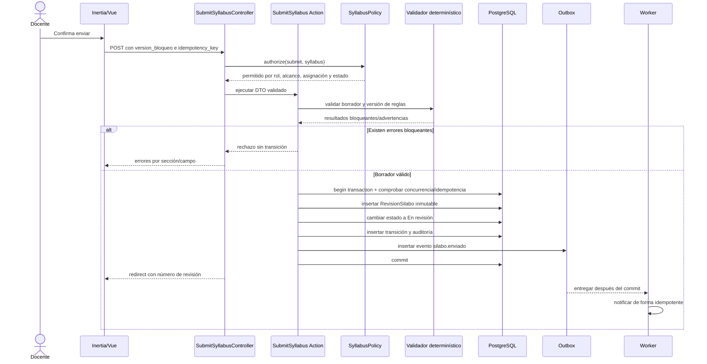
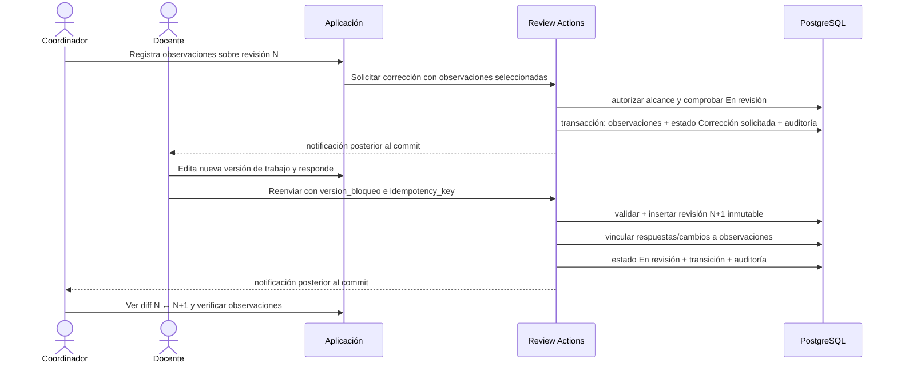
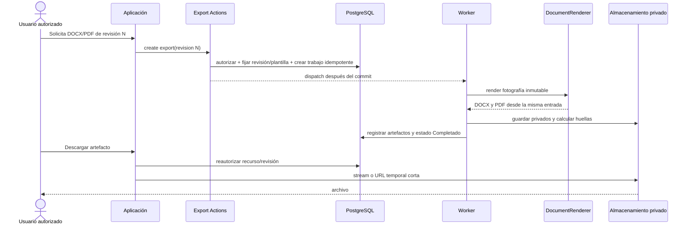
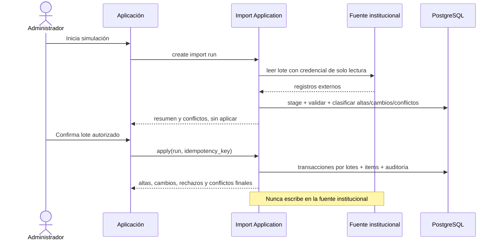

# Secuencias canónicas

Estos diagramas fijan responsabilidades e invariantes. Los nombres concretos de clases
pueden variar, pero no se omiten autorización, transacción, inmutabilidad, auditoría ni
efectos posteriores al commit.

## Enviar un sílabo



## Solicitar corrección y reenviar



## Aprobar y reabrir

```mermaid
sequenceDiagram
    actor Coo as Coordinador
    participant UI as Inertia/Vue
    participant A as Approval Actions
    participant DB as PostgreSQL
    participant O as Outbox

    Coo->>UI: Confirma aprobación de revisión N
    UI->>A: approve(revision N, idempotency_key)
    A->>DB: autorizar + validar estado/reglas/observaciones
    A->>DB: transacción: Aprobacion(N) + estado Aprobado + auditoría + outbox
    A-->>UI: Aprobado; revisión N bloqueada
    O-->>O: habilita notificación/exportación después del commit

    opt Reapertura autorizada
        Coo->>UI: Indica causa y confirma reabrir
        UI->>A: reopen(approval N, reason)
        A->>DB: autorizar + transacción
        A->>DB: insertar Reapertura y nueva revisión de trabajo enlazada
        A->>DB: conservar Aprobacion(N) y revisión N intactas
        A->>DB: transición + auditoría + outbox
        A-->>UI: nueva revisión editable identificada
    end
```

## Solicitar asistencia de IA

```mermaid
sequenceDiagram
    actor D as Docente
    participant UI as Inertia/Vue
    participant A as RequestAiAnalysis
    participant DB as PostgreSQL
    participant Q as Redis/Worker
    participant AI as Servicio IA local

    D->>UI: Solicita análisis de campo habilitado
    UI->>A: request(field, content_hash)
    A->>DB: autorizar + resolver plantilla y fuentes activas
    A->>DB: crear/reusar EjecucionIA con clave compatible
    A-->>UI: estado Pendiente
    A-->>Q: job después del commit
    Q->>AI: contrato versionado, datos mínimos y fuentes autorizadas
    alt Respuesta válida
        AI-->>Q: recomendaciones + referencias
        Q->>DB: validar referencias y persistir evidencia/estado Completado
        Q-->>UI: notificación/actualización
        D->>UI: compara y aplica/ignora explícitamente
        UI->>DB: persiste decisión y cambio humano
    else Timeout, fallo o evidencia insuficiente
        AI-->>Q: error tipado/no concluyente
        Q->>DB: estado Fallido/No concluyente y diagnóstico seguro
        Q-->>UI: ayuda no disponible; flujo principal continúa
    end
```

## Generar y descargar documentos



## Importar datos institucionales



